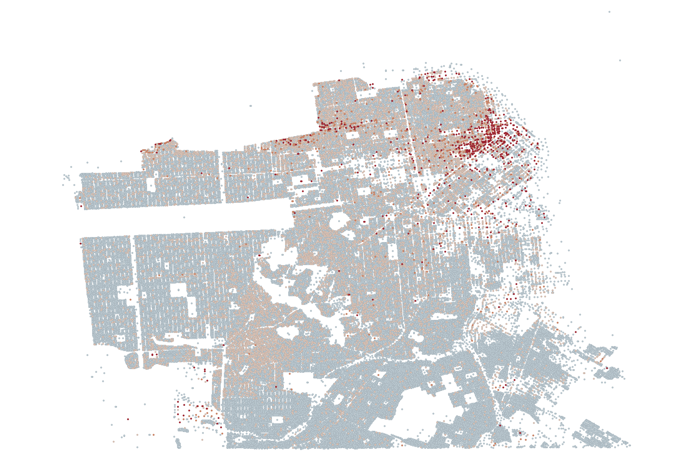

```{r setup, include=FALSE}
knitr::opts_chunk$set(
	fig.pos = "H",
	message = FALSE,
	warning = FALSE
)
library(tigris)
library(gplots)
library(foreign)
library(car)
library(qwraps2)
library(knitr)
library(ggplot2)
library(plotrix)
library(stargazer)
library(doBy)
library(fBasics)
library(gridExtra)
library(cowplot)
```

# Introduction

In the past decade, several American cities have instituted inclusionary housing policies to combat rising rents and inequality. These policies require a given share of new residential units constructed in a city to be made affordable to low or moderate-income residents. State and local governments implement such standards through various means, including mandatory requirements, voluntary and incentive-based programs, direct subsidies to developers, and geographically determined zoning laws.

\vspace{0.25cm}

Inclusionary programs are broadly popular among policymakers, urban planners, and advocates of affordable housing. These groups view such programs as a way to maintain neighborhood economic diversity and prevent cities from pricing out low-income residents. However, inclusionary policies are generally unpopular among real estate developers and have encountered opposition from economists. Critics argue that inclusionary regulations artificially restrict the supply of market-rate units in a city, drive up rents and home prices, and reduce the incentive for developers to build new housing. According to this line of thought, aside from a few lucky low-income families that obtain affordable units, the majority of a city's residents are made worse off by such policies.

\vspace{0.25cm}

In 2002, the City of San Francisco established the Inclusionary Housing Program, which has since become one of nation’s largest and longest-running inclusionary housing programs. Guided by Section 415 of the city's planning code, the program requires housing developers that propose a new residential project with 10 or more units to either reserve a percentage of units to be rented or sold below-market rate, pay an in-lieu fee, or pursue one of several other options. Developers are also offered the opportunity to complete some combination of these requirements.

\vspace{0.25cm}

In this paper, we estimate the effect of San Francisco's Inclusionary Housing Program on residential property values in the areas surrounding affordable developments. Using a difference-in-differences model on a panel dataset of all eligible properties in the city, we find significant evidence to support the conclusion that the program has a positive effect on nearby property values. These results are consistent with economic theory and the existing academic literature.

### San Francisco's Inclusionary Housing Program

Since 2002, the City of San Francisco has administered one of the country's largest inclusionary housing programs. This program, known as the Inclusionary Housing Program, is a legal requirement in the city's zoning laws that mandates developers who construct residential projects with greater than 10 units to pursue one of the following options:

\vspace{0.25cm}

*   Reserve a percentage of units in the new building to be rented or sold at a below market rate
*   Reserve a percentage of units in another building they build to be rented or sold at a below market rate
*   Pay a fee
*   Dedicate land that will become affordable housing
*   A combination of the above

\vspace{0.25cm}

If the developer chooses the first option, the actual number of affordable units and levels of "affordability" required for the project are determined by a complex set of guidelines determined by the city's Planning Department. If not, the development's "in-lieu" fee is calculated on a individual basis based on property and area-specific characteristics as part of the project's approval process. For the purposes of this paper, we simplify the situation and consider developments that pursue the first option to be "affordable developments" built at the location of interest, and all others to fall into an "otherwise" category. While we would like to further study outcomes related to fee payment and off-site below-market rate construction, we could not find publicly available data regarding the size of the fee or the characteristics of off-site projects.

\vspace{0.25cm}

Once these affordable properties are constructed, San Francisco residents meeting certain income criteria are eligible to enter into a lottery for the affordable units. Both renters and buyers can apply online for properties designated specifically for individuals of their income level, and rank their preferences among multiple units. Applicants who live nearby, are designated as rent-burdened, and who have previously been evicted are given the highest priority in the lottery. Following a lengthy process that often takes several months, the new owner of the property then purchases or rents it from the developer at the designated price. This program has netted the city government $198 million in inclusionary housing fees, which it has used to help developers finance new affordable construction.

# Literature Review

According to a traditional supply and demand model, when a policy like rent control imposes a restriction on the supply of market-rate housing, we should therefore see an increase in the price of market-rate housing. In this case, San Francisco's inclusionary program has a similar effect to rent control, although it differs in its mechanism. Here, instead of capping the rents landlords can charge, the city government mandates a given supply of units in new developments be made affordable, which it then doles out to different individuals based on their income levels. However, some have argued that this is indistinguishable from rent control, in that inclusionary housing still reduces developer's incentives to build and drives up costs for low and middle-income residents. Given this result, in our data, we might expect to see a slightly larger change in median home values in areas surrounding affordable housing developments compared to areas surrounding non-affordable developments. 

\vspace{0.25cm}

Despite the general consensus from economists that such restrictions yield negative outcomes ([Booth IGM Survey](http://www.igmchicago.org/surveys/rent-control)), few empirical studies have been conducted into the effects of inclusionary housing policies. While there have been several policy reports and feasibility/cost-benefit analyses, there is little academic literature on the topic. Some of the potential barriers to research include the small scope of these programs, the recency of their implementation, a lack of available data, and legal complexities in evaluating the effects of these policies. However, we were able to find several studies of related topics, which mostly suggested that the presence of affordable housing tends to increase nearby rents and property values.

\vspace{0.25cm}

In “The External Effects of Place-Based Subsidized Housing" [@schwartzExternalEffectsPlacebased2006], the authors estimate the effect of affordable housing developments on surrounding property values in New York City. They find that affordable housing developments generally had a positive effect on neighboring housing values, with diminishing effects as the distance from the property increased. This study is similar to ours in that we also measure the relationship between property values and distance from affordable units, and find a difference-in-difference model to be a useful approach for estimating this effect. However, we aim to expand on the results of this paper by using only the subset of Section 415-mandated properties as our unit of analysis, rather than simply running a regression of "distance to nearest affordable property" on every property in the city.

\vspace{0.25cm}

Another paper that attempted to address this question was “Assessing the Property Value Impacts of the Dispersed Housing Subsidy Program in Denver" [@santiagoAssessingPropertyValue2001]. This study took advantage of the increases in acquisition of private properties by the public housing authorities in Denver in the 1990s to measure the impact of proximity to subsidized housing on property values. As in the Schwartz study, the authors found a generally positive impact, although with significant outliers in neighborhoods with high concentrations of low-income residents.  

\vspace{0.25cm}

The City of San Francisco itself conducted an analysis of the viability of its Inclusionary Housing Program in 2016. This paper, drafted by an external consulting firm, included recommendations for affordable housing policy that would have a minimal impact on the feasibility of new developments. It predicted that a 1% increase in the city's inclusionary requirement (the percentage of units in developments mandated to be designated as affordable) would decrease the supply of housing in the city by 1.8%, and increase housing prices and rents by 2%. The study also estimated the direct impact of the program on low-income households to be \$660 million, although the secondary impact of cheap housing being freed up by tenants moving into new affordable units was not taken into account. While these results are consistent with other literature on this topic, the study was primarily a simulation exercise and did not incorporate real-world evidence of the policy's effect.

# Research Design

In this paper, we evaluate San Francisco’s Inclusionary Housing Program by leveraging the fact that the policy allows developers to pay an in-lieu fee or pursue another alternative option instead of building affordable housing units. This creates a naturally-occurring treatment group (the developments that chose to build affordable housing) and control group (the developments that chose not to build affordable housing). Considering all eligible properties in the city to be our unit of analysis, we use a difference-in-differences approach to compare changes in home values in the immediate areas surrounding properties in these two groups from the pre-construction to post-construction period. In doing so, we can estimate the effect of the introduction of affordable units on neighborhood property values.

\vspace{0.25cm}

The identifying assumption of this model is that the pre-treatment trends in the surrounding property values for affordable and non-affordable developments are parallel, conditional on the observables that determine whether or not a developer adheres to the below-market-rate mandate. We assume that in the absence of the Inclusionary Housing Program, the trends in property values in the areas surrounding the affordable and non-affordable developments with similar characteristics would have continued in a parallel manner in the post-construction period.

\vspace{0.25cm}

The concern that arises with this approach is that developers will select into the treatment and control groups based on unobservable factors that are difficult to estimate. For example, if developers believe that the neighborhood will experience rising housing prices in the future, they might choose to pay the in-lieu fee so that they can earn the full profits from selling/renting market-rate units in the future. In contrast, a developer that thinks the market will be relatively stagnant might choose to build affordable units and take the steady stream of profits instead of spending a large amount of money on the in-lieu fee. Therefore, the parallel trends assumption may not be valid since unobservable neighborhood characteristics can influence developers’ decision to build units.

\vspace{0.25cm}

In our analysis below, we provide evidence to suggest that the parallel trends assumption can be justified in our data. We run several models using various combinations of controls, including a set of neighborhood indicators, such that our estimates measure the effect of the program conditional on properties having similar underlying characteristics. With this specification, we can therefore interpret the difference-in-differences estimate as the differential change in the median of *immediately* neighboring property values for treated vs. non-treated developments, given that the properties are in the same *general* neighborhood of the city. We evaluate this pre-trends assumption in the data both visually and empirically using a lagged variable model.

# Data Description

The primary data source we use in this paper is a multi-year panel dataset from the City of San Francisco's open data portal with assessed parcel-level land and improvement values for every property in the city for each of the years 2007-2017. This dataset, called "Assessor Historical Secured Property Tax Rolls," also contains a large number of property-level characteristics including square footage, number of bathrooms and bedrooms, property construction year, and most recent transaction date. In this dataset, we construct a "Total Assessed Value" variable by summing the assessed land and improvement values for each property in each year. This is a standard metric of property value found on real estate listing sites such as Zillow.

\vspace{0.25cm}

To prepare this dataset for analysis, we removed datapoints where the "Total Assessed Value" was missing or zero, since these are primarily empty lots that do not contribute meaningful information when estimating the effect of affordable housing on surrounding property values. To justify this assumption, we found that the median number of rooms among these removed properties was zero, compared to six rooms in the combined dataset. For the removed properties with a non-zero number of rooms, the zero assessed value was a result of missing data. This was a relatively minor change: in the 2007 data, this change only removed 6,938 out of 197,614 rows, about $3.5\%$ of the data.

\vspace{0.25cm}

Summary statistics for the tax assessment data are shown in the following table:

```{r echo=FALSE, results='asis'}

tax.data <- read.csv("../tax_data.csv")

tax.data$Total.Assessed.Value <- tax.data$Assessed.Improvement.Value + tax.data$Assessed.Land.Value

zeroes.dropped <- tax.data[tax.data$Total.Assessed.Value > 1 & is.na(tax.data$Total.Assessed.Value) == FALSE,]
zeroes.dropped$Year <- zeroes.dropped$Closed.Roll.Year

summary_1 <-
  list("Total Assessed Property Value" =
       list("Mean Assessed Value (SD)" = ~ qwraps2::mean_sd(.data$Total.Assessed.Value),
            "Median Assessed Value" = ~ median(.data$Total.Assessed.Value)
       )
  )

by_year <- summary_table(dplyr::group_by(zeroes.dropped, Year), summary_1)

kable(t(by_year))
```

\vspace{0.25cm}

Property values in San Francisco have been steadily increasing for the past decade, and at an increasing rate as we can see from the convexity of the following plot: 

\vspace{0.25cm}

```{r echo=FALSE, message=FALSE, warning=FALSE}

plotmeans(Total.Assessed.Value ~ Year, main="Mean Assessed Property Values in San Francisco by Year, 2007-Present", data=zeroes.dropped,
          cex.axis=0.75, cex.lab=0.75, cex.main=0.75, n.label=FALSE)

```

\vspace{0.25cm}

As evidenced by the table, mean assessed property values are nearly twice the median for every year in the dataset, suggesting that large outliers heavily influence the distribution of property values. The following figure provides further evidence of the heterogeneity in property values across the city. This standard deviation map displays each residential property in our dataset in 2017, where darker shades indicate greater deviance from the city-wide average total assessed property value. As mentioned earlier, if we naively run a regression, we encounter an endogeneity problem in that the developer's decision to pursue the affordable housing option is likely to be correlated with other neighborhood-level economic, demographic, and housing conditions.

\vspace{0.25cm}

{width=75%}
 
\vspace{0.25cm}

Another important consideration is that assessed land values - the primary outcome variable of interest in our analysis - are impacted significantly by California's Proposition 13, an amendment to the state constitution passed in 1978 that revised the state's property value assessment system. Prior to Proposition 13, properties were assessed using a cost-based approach that estimated the market value of the home based on changes in the sale prices of neighboring units. Following the law's passage, however, property values were "frozen," with 1976 taken as a "base year" and future assessed values increasing according to changes in the California CPI with a maximum increase of two percent per year. This policy was extremely controversial, eventually reaching the Supreme Court, and has provided a useful natural experiment for a large body of economic research.

\vspace{0.25cm}

Given our differences-in-differences model, it would be a clear challenge to the validity of our results if the values of different properties all increased at the same rate. However, the proposition also specifies that when properties are sold or renovated, they are reassessed to the transaction price of the sale, or increased by the cost of the renovation. Therefore, to avoid the problem imposed by Proposition 13, we chose not to evaluate individual property-specific data, but instead to calculate mean and median values within various distance rings around affordable properties. Using this approach, the mean and median tax assessment values (while still biased downwards due to the 2\% cap) are able to capture true changes in market value as a result of nearby transactions. Examining the aggregate level means and medians in the table above, we see that there are several years where the tax assessed values increase well in excess of the two percent cap, suggesting that the re-valuation as a result of transaction activity is a sufficient indicator.

\vspace{0.25cm}

The affordable housing designation dataset, "Residential Projects With Inclusionary Requirements," was also pulled from the City of San Francisco's open data portal. This dataset contains information about all housing developments in the city with greater than 10 units that were subject to the inclusionary housing requirement since the program began. This data includes geotags, dates of permit issuance and completion, and information about the number and type of units included in the development. Most importantly, it contains a variable detailing the developers' declaration in response to the Section 415 requirement. As discussed earlier, we recoded this variable to a dummy which takes the value 1 if the developer builds below market-rate housing at the location specified in the data, and 0 otherwise (which encompasses all other available options under Section 415).

\vspace{0.25cm}

Again, we assume for the purposes of this analysis that developers do not choose to provide on-site affordable housing based on their expectations of property-value trends in the areas surrounding affordable units. Comparing the distributions of the distances from the mean location of all properties in the tax dataset of the two different types of projects in the affordable project dataset, we found that there was not a significant difference between the two with a t-statistic of 0.843 and a p-value of 0.399. Therefore we conclude that our assumption is well founded. Nonetheless, we control for the larger neighborhood unit and other property-level characteristics in our model, to ensure that the "treatment" and "control" groups are comparable.

\vspace{0.25cm}

\begin{tabular}{r|r|r|r|r|r|r}
\hline
data set & mean distance& median distance & stdev & counts & t-statistic & p-val\\
\hline
on-site & 0.0244 & 0.0175 & 0.0216 & 278 & - & - \\
not on-site & 0.0264 & 0.0190 & 0.0227 & 128 & - & - \\
\hline
t-test:  & - & - & - & - & 0.843 & 0.399\\
\hline
\end{tabular}

\vspace{0.25cm}

By visually examining the locations of developments that chose to build affordable housing on-site and off-site, there also does not appear to be a spatial association between the two distributions. The following map again displays every property in the city (N=204,146), but here we overlay the Section 415-eligible but non-affordable properties (N=1,659) in red, and the Section 415-eligible properties that built affordable housing (N= 1,945) in blue. The data comes from 2017, the most recent year in our dataset. 

{width=75%}

\vspace{0.25cm}

To match the tax assessment data to the affordable housing designation data, we merged the two datasets on latitude and longitude coordinates to five decimal places, which is sufficient to identify properties within 1.1 meters. Although both datasets included the addresses of all the properties assessed, because of inconsistencies in the formatting of this data, it was too difficult to use this variable to link the two datasets. One issue with our approach is that it can possibly result in different units with the same location coordinates being merged together. However, because our variable of interest is the assessed values of nearby homes, and because units in virtually identical locations are likely to belong to the same development, our results should be unaffected. To optimize our speed of computation, we therefore only calculated the mean and median values for unique coordinates, because the surrounding values are identical for properties in the same location.

\vspace{0.25cm}

We then calculated the distance of every development to every unique property coordinate within the tax assessment data using the great-circle distance as calculated by the Haversine formula in R's `geosphere` package. To speed up our calculation, we only examined the properties in the same neighborhood as the development, which could lead to potential inaccuracies for properties on the edge of neighborhood boundaries. However, because the distance rings are extremely small compared to the size of the city's neighborhood geographis, we imagine that these instances will be rare and unlikely to significantly affect our results.

\vspace{0.25cm}

To estimate the surrounding mean and median values for each development, we took three subsets corresponding to residential units within 100, 200, and 300 meters of the development, then calculated the mean and median values of the "Total Assessed Value" variable for each of these subsets. Therefore, for each property subject to the inclusionary housing mandate, we had data on that property's Section 415 designation, an index difference from the specified year to the completion year of the development, and the mean and median tax assessed values within each specified distance boundary for every year from 2007-2017.

\vspace{0.25cm}

{width=75%}


{width=75%}

\vspace{0.25cm}

### Model and Analysis

Our baseline model is as follows:

$$\text{Y}_{it}=\alpha+\beta S_{i}+\gamma T_{t}+\delta(S_{i}\times T_{t})+\rho\mathbf{X}_{it}+\epsilon_{it}$$

$Y_{it}$ is the median property value for the surrounding area $i$ in year $t$, where surrounding area is defined by a given Haversine distance band of 100, 200, or 300 meters. $S_i$ is a dummy for a simplified version of the developer's Section 415 declaration, which takes the value 1 if the developer builds below market-rate housing at the location specified in the data, and 0 otherwise (which encompasses all other available options under Section 415). $T_t$ is a dummy for whether the specified year was before (=0) or after (=1) construction of the property was completed. $\mathbf{X}_{it}$ is a vector of covariates, which includes neighborhood and property-specific controls such as .  

\vspace{0.25cm}

This regression is run on the merged affordable housing and tax assessment datasets for periods $t-1$ to $t+1$, where each row represents a property eligible. The difference-in-differences estimate from this regression can be interpreted as follows:

$$\hat{\delta}_{DD}=\bar{Y}_{\text{post}}^{\text{affordable}}-\bar{Y}_{\text{pre}}^{\text{affordable}}-(\bar{Y}_{\text{post}}^{\text{pay fee}}-\bar{Y}_{\text{pre}}^{\text{pay fee}})$$

\vspace{0.25cm}

The coefficients are also easily interpretable: $\alpha$ is the average pre-construction median surrounding property value for non-affordable properties,  $\beta$ is the affordable housing-specific effect on surrounding property values, $\gamma$ is the time trend common to both affordable and non-affordable properties, and $\delta$ is Diff-in-diff estimator: true effect of treatment.

\vspace{0.25cm}

```{r echo=FALSE, message=FALSE, warning=FALSE}

# Read in mean and median data, merge files
total_clean_mean_drop_zeros <- read.csv("../total_clean_mean_drop_zeros.csv")
total_clean_median_drop_zeros <- read.csv("../total_clean_median_drop_zeros.csv")
total_clean_median_drop_zeros$dist_100_mean <- total_clean_mean_drop_zeros$dist_100_mean
total_clean_median_drop_zeros$dist_200_mean <- total_clean_mean_drop_zeros$dist_200_mean
total_clean_median_drop_zeros$dist_300_mean <- total_clean_mean_drop_zeros$dist_300_mean

final.data <- total_clean_median_drop_zeros

# Fill in missing row
final.data[final.data$X==45646,]$dist_100_mean <- total_clean_mean_drop_zeros[total_clean_mean_drop_zeros$X==45646,]$merged_2014_100_mean
final.data[final.data$X==45646,]$dist_200_mean <- total_clean_mean_drop_zeros[total_clean_mean_drop_zeros$X==45646,]$merged_2014_200_mean
final.data[final.data$X==45646,]$dist_300_mean <- total_clean_mean_drop_zeros[total_clean_mean_drop_zeros$X==45646,]$merged_2014_300_mean
final.data[final.data$X==45646,]$dist_100_median <- final.data[final.data$X==45646,]$merged_2014_100_median
final.data[final.data$X==45646,]$dist_200_median <- final.data[final.data$X==45646,]$merged_2014_200_median
final.data[final.data$X==45646,]$dist_300_median <- final.data[final.data$X==45646,]$merged_2014_300_median

# Encode time and treatment dummies
final.data$time <- ifelse(final.data$year_index >= 1, 1, 0)
final.data$treated <- ifelse(final.data$simple415 == "On-site BMR Project", 1, 0)
final.data$did = final.data$time * final.data$treated

# Encode log variables
final.data$log.dist_100_mean <- log(final.data$dist_100_mean)
final.data$log.dist_100_median <- log(final.data$dist_100_median)
final.data$log.dist_200_mean <- log(final.data$dist_200_mean)
final.data$log.dist_200_median <- log(final.data$dist_200_median)
final.data$log.dist_300_mean <- log(final.data$dist_300_mean)
final.data$log.dist_300_median <- log(final.data$dist_300_median)

no.outliers <- final.data[final.data$LocationKey != "(37.79054, -122.3959)",]
time.subset <- no.outliers[no.outliers$year_index == c(-1,0,1),]

```

```{r echo=FALSE, message=FALSE, warning=FALSE, fig.width=8, fig.height=4}

# Visualize diff in diff model

year_means_log_100 <- summaryBy(log.dist_100_median ~ treated + year_index, data=time.subset, FUN=c(length,mean,sd))
year_means_log_200 <- summaryBy(log.dist_200_median ~ treated + year_index, data=time.subset, FUN=c(length,mean,sd))
year_means_log_300 <- summaryBy(log.dist_300_median ~ treated + year_index, data=time.subset, FUN=c(length,mean,sd))

year_medians_log_100 <- summaryBy(log.dist_100_median ~ treated + year_index, data=time.subset, FUN=c(length,median,sd))
year_medians_log_200 <- summaryBy(log.dist_200_median ~ treated + year_index, data=time.subset, FUN=c(length,median,sd))
year_medians_log_300 <- summaryBy(log.dist_300_median ~ treated + year_index, data=time.subset, FUN=c(length,median,sd))


p1 <- ggplot(data=year_means_log_100, aes(x=year_index,y=log.dist_100_median.mean)) +
  geom_line(data = year_means_log_100[year_means_log_100$treated==1,],
            aes(x = year_index, y = log.dist_100_median.mean), color = "red") +
  xlim(-1,1) +
  geom_line(data = year_means_log_100[year_means_log_100$treated==0,], aes(x = year_index, y = log.dist_100_median.mean),
            color = "blue") +
  geom_vline(xintercept=0) +
  xlab("Years Since Construction") +
  ylab("City Avg. of Log(Vals)") +
  ggtitle("DiD: City Avg. of 100m Median Values") +
  theme(axis.title.y = element_text(size=0.5),
        axis.title.x = element_text(size=0.5)) + 
  theme_bw()

p2 <- ggplot(data=year_means_log_200, aes(x=year_index,y=log.dist_200_median.mean)) +
  geom_line(data = year_means_log_200[year_means_log_200$treated==1,],
            aes(x = year_index, y = log.dist_200_median.mean), color = "red") +
  xlim(-1,1) +
  geom_line(data = year_means_log_200[year_means_log_200$treated==0,], aes(x = year_index, y = log.dist_200_median.mean),
            color = "blue") +
  geom_vline(xintercept=0) +
  xlab("Years Since Construction") +
  ylab("City Avg. Log(Values)") +
  ggtitle("DiD: City Avg. of 200m Median Values") +
  theme(axis.title.y = element_text(size=0.5),
        axis.title.x = element_text(size=0.5)) + 
  theme_bw()
  
p3 <-ggplot(data=year_means_log_300, aes(x=year_index,y=log.dist_300_median.mean)) +
  geom_line(data = year_means_log_300[year_means_log_300$treated==1,],
            aes(x = year_index, y = log.dist_300_median.mean), color = "red") +
  xlim(-1,1) +
  geom_line(data = year_means_log_300[year_means_log_300$treated==0,], aes(x = year_index, y = log.dist_300_median.mean),
            color = "blue") +
  geom_vline(xintercept=0) +
  xlab("Years Since Construction") +
  ylab("City Avg. Log(Values)") +
  ggtitle("DiD: City Avg. of 300m Median Values") +
  theme(axis.title.y = element_text(size=0.5),
        axis.title.x = element_text(size=0.5)) + 
  theme_bw()

p4 <- ggplot(data=year_medians_log_100, aes(x=year_index,y=log.dist_100_median.median)) +
  geom_line(data = year_medians_log_100[year_medians_log_100$treated==1,],
            aes(x = year_index, y = log.dist_100_median.median), color = "red") +
  xlim(-1,1) +
  geom_line(data = year_medians_log_100[year_medians_log_100$treated==0,], aes(x = year_index, y = log.dist_100_median.median),
            color = "blue") +
  geom_vline(xintercept=0) +
  xlab("Years Since Construction") +
  ylab("City Med. Log(Values)") +
  ggtitle("DiD: City Med. of 100m Median Values") +
  theme(axis.title.y = element_text(size=0.5),
        axis.title.x = element_text(size=0.5)) + 
  theme_bw()

p5 <- ggplot(data=year_medians_log_200, aes(x=year_index,y=log.dist_200_median.median)) +
  geom_line(data = year_medians_log_200[year_medians_log_200$treated==1,],
            aes(x = year_index, y = log.dist_200_median.median), color = "red") +
  xlim(-1,1) +
  geom_line(data = year_medians_log_200[year_medians_log_200$treated==0,], aes(x = year_index, y = log.dist_200_median.median),
            color = "blue") +
  geom_vline(xintercept=0) +
  xlab("Years Since Construction") +
  ylab("City Med. Log(Values)") +
  ggtitle("DiD: City Med. of 200m Median Values") +
  theme(title = element_text(size=0.1),
        axis.title.y = element_text(size=0.5),
        axis.title.x = element_text(size=0.5)) + 
  theme_bw()
  
p6 <-ggplot(data=year_medians_log_300, aes(x=year_index,y=log.dist_300_median.median)) +
  geom_line(data = year_medians_log_300[year_medians_log_300$treated==1,],
            aes(x = year_index, y = log.dist_300_median.median), color = "red") +
  xlim(-1,1) +
  geom_line(data = year_medians_log_300[year_medians_log_300$treated==0,], aes(x = year_index, y = log.dist_300_median.median),
            color = "blue") +
  geom_vline(xintercept=0) +
  xlab("Years Since Construction") +
  ylab("City Med. Log(Values)") +
  ggtitle("DiD: City Med. of 300m Median Values") +
  theme(axis.title.y = element_text(size=0.5),
        axis.title.x = element_text(size=0.5)) + 
  theme_bw()

  
theme_set(theme_cowplot(font_size=1)) 
plot_grid(p1, p2, p3, p4, p5, p6, ncol=3)


```

\vspace{0.25cm}

In these plots, we generally see visual evidence of the parallel trends assumption in the data as evidenced by the parallel slopes in the treatment . While there may be enough evidence to support the parallel trends assumption . We also 

\vspace{0.25cm}

```{r echo=FALSE, message=FALSE, warning=FALSE, paged.print=FALSE, results='asis'}

m1 <- lm(log.dist_100_median ~ treated + time + did + Assessor.Neighborhood.District, data = time.subset)
m2 <- lm(log.dist_200_median ~ treated + time + did + Assessor.Neighborhood.District, data = time.subset)
m3 <- lm(log.dist_300_median ~ treated + time + did + Assessor.Neighborhood.District + Number.of.Bedrooms, data = time.subset)

m4 <- lm(log.dist_100_mean ~ treated + time + did + as.factor(Assessor.Neighborhood.District), data = time.subset)
m5 <- lm(log.dist_200_mean ~ treated + time + did, data = time.subset)
m6 <- lm(log.dist_300_mean ~ treated + time + did + as.factor(Assessor.Neighborhood.District), data = time.subset)
 
stargazer(m1, m2, m3, type='latex', 
          dep.var.labels=c("Log(100m Median)","Log(200m Median)", "Log(300m Median)"),
          covariate.labels=c("On-Site Affordable Housing", "Post-Construction", "Diff-in-Diff Estimator", "Constant"),
          font.size="small", header=FALSE, omit = c("Assessor.Neighborhood.District", "Number.of.Bedrooms"), omit.labels = c("Neighborhood dummies?"))

stargazer(m4, m5, m6, type='latex', 
          dep.var.labels=c("Log(100m Mean)","Log(200m Mean)", "Log(300m Mean)"),
          covariate.labels=c("On-Site Affordable Housing", "Post-Construction", "Diff-in-Diff Estimator", "Constant"),
          font.size="small", header=FALSE, omit = "Assessor.Neighborhood.District", omit.labels = c("Neighborhood dummies?"))

```


# Conclusion

By leveraging the unique legal framework of San Francisco's affordable housing mandate, as well as the public availability of detailed micro-level spatial data, we evaluate the impact of the city's Inclusionary Housing Program on residential property values in the surrounding area. We find modest evidence to suggest that this policy has a positive effect on nearby home values, contradicting its supposed aim as a tool for reducing the cost of housing.

\vspace{0.25cm}

This analysis carries valuable implications for assessing the viability of inclusionary housing policies as a means for addressing economic inequality. As a policy lever that has been adopted in cities nationwide, inclusionary housing offers the promise of economic opportunity for low-income residents affected by gentrification and rising home prices. By providing estimates for the effect of this policy in San Francisco, where this approach has been implemented to a greater degree than any other major U.S. city, we show that such programs can often have undesired secondary effects.

\vspace{0.25cm}

While our model's estimates are highly significant within the scope of our data, we are less certain of their generalizability to other contexts. Other cities have different, and could. However, we have also reason to believe that the market dynamics within narrow geographic are . When considering the 

\vspace{0.25cm}

A more comprehensive evaluation of the effectiveness of this program might also address questions related to its effect on outcomes for individuals who are selected to participate in the program. Although individual-level data is not publicly available, the random assignment generated by the program's lottery structure could allow for a rigorous quasi-experimental approach.

# References
